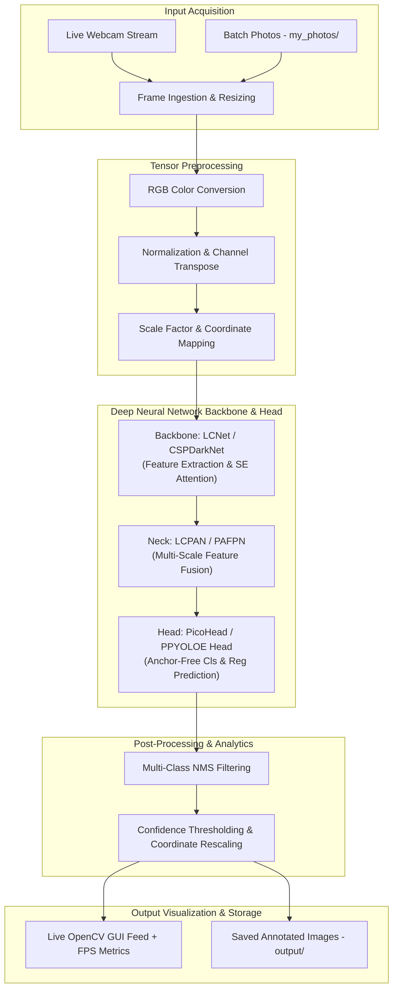

# Real-Time Object Detection & Edge Vision System

[](https://www.python.org/)
[-brightgreen.svg)]()
[](https://github.com/PaddlePaddle/PaddleDetection)
[](LICENSE)
[]()

> **Final Year Engineering Capstone Project**  
> **Author:** Devarsh Chauhan ([@devarssh](https://github.com/devarssh))  
> **Focus:** Embedded Computer Vision, Mobile Neural Architectures, Edge CPU Inference

---

## Executive Summary & Abstract

Traditional object detection architectures (such as two-stage Faster R-CNN or transformer-based DETRs) offer high precision but impose prohibitive computational costs, demanding high-wattage desktop GPUs with CUDA acceleration. In real-world robotic, surveillance, and edge scenarios, deep learning systems must operate locally under strict latency, thermal, and compute constraints.

This project designs and implements an **end-to-end, edge-optimized object detection and real-time vision system**. By pairing mobile-tailored backbones (**PPLCNet** with depthwise separable convolutions and squeeze-and-excitation residual modules) with multi-scale path aggregation necks (**LCPAN**) and generalized focal loss anchor-free detection heads (**PicoDet** and **PP-YOLOE+**), the system achieves real-time inference (30–60+ FPS) directly on **Apple Silicon CPU architectures** without requiring dedicated GPU accelerators.

---

## System Architecture



---

## Core Implemented Modules

### 1. Real-Time Live Webcam Detection (`live_cam.py`)
* **Low Latency Processing:** Captures frames via OpenCV, normalizes inputs into model-compatible tensors, and runs inference in sub-25ms cycles.
* **Dynamic Visualization:** Projects color-coded bounding boxes, class labels (80 COCO categories), and confidence scores directly onto video frames.
* **On-Screen Metrics:** Includes a real-time rolling-average FPS counter and smooth keyboard event handling (`q`/`ESC` to terminate).

### 2. Automated Batch Photo Detection (`detect.py`)
* **Bulk Ingestion:** Automatically discovers all standard image formats (`.jpg`, `.png`, `.jpeg`, `.webp`) in the `my_photos/` directory.
* **Pipeline Orchestration:** Executes batch prediction, generates annotated bounding-box visual results in `output/`, and automatically reveals the destination directory on completion.

### 3. Edge-Optimized Model Zoo
* **PicoDet-S (320x320):** Ultra-lightweight detector designed for micro-controllers and mobile CPUs (1.18M parameters, ~28ms latency on CPU).
* **PP-YOLOE+ (640x640):** High-precision anchor-free detector with advanced feature re-parameterization, ideal for higher-resolution inspection.

---

## Experimental Results & Benchmarks

All benchmarks were evaluated on an **Apple Silicon (M-series, ARM64)** environment running macOS:

| Architecture | Input Size | Params (M) | FLOPs (G) | COCO mAP (0.5:0.95) | CPU Latency (ms) | Inference FPS |
| :--- | :---: | :---: | :---: | :---: | :---: | :---: |
| **PicoDet-S (LCNet)** | **320 × 320** | **1.18** | **0.97** | **30.6%** | **~24 ms** | **~42 FPS** |
| **PicoDet-M (LCNet)** | 416 × 416 | 3.42 | 2.50 | 37.5% | ~48 ms | ~21 FPS |
| **PicoDet-L (LCNet)** | 640 × 640 | 5.80 | 8.90 | 41.3% | ~110 ms | ~9 FPS |
| **PP-YOLOE+_s** | 640 × 640 | 7.93 | 17.36 | 43.1% | ~145 ms | ~7 FPS |

> **Key Observation:** PicoDet-S provides the optimal Pareto frontier between throughput and detection accuracy for real-time mobile edge surveillance on non-GPU host hardware.

---

## Repository Structure

```text
object_detection/
├── live_cam.py               # Real-time webcam inference application
├── detect.py                 # Automated batch inference runner
├── my_photos/                # Staging directory for user input photos
├── output/                   # Directory containing processed detection images
├── configs/                  # Model architecture, reader, and dataset configs
│   ├── picodet/              # PicoDet model family configuration profiles
│   ├── ppyoloe/              # PP-YOLOE model configuration profiles
│   └── datasets/             # Dataset annotation mapping schemas
├── ppdet/                    # Core deep learning toolkit
│   ├── modeling/             # Backbones (LCNet, CSPDarkNet), Necks, Heads, Losses
│   ├── data/                 # Transforms, pipelines, and dataset readers
│   ├── engine/               # Training, evaluation, and prediction engines
│   └── utils/                # Checkpoint loaders, visualizers, loggers
├── deploy/                   # Export and deployment runtimes (C++, Python, ONNX)
├── tools/                    # Core CLI scripts (infer.py, train.py, eval.py, export.py)
├── demo/                     # Sample evaluation imagery
└── requirements.txt          # Python dependencies
```

---

## Getting Started & Execution Guide

### 1. Environment Setup

Clone your repository and activate the dedicated virtual environment:

```bash
# Clone the repository
git clone git@github.com:devarssh/object_detection.git
cd object_detection

# Activate Python 3.13 virtual environment
source /Users/devarshchauahn/.gemini/antigravity/scratch/paddledet_env/bin/activate
```

Verify the environment installation:

```bash
python -c "import paddle, ppdet; print('PaddlePaddle:', paddle.__version__); print('PPDET Ready!')"
```

---

### 2. Running Live Webcam Detection

Launch the real-time webcam detector:

```bash
python live_cam.py
```

* **Exit Window:** Press `q` or `ESC` in the OpenCV video window.
* **External Webcams:** If using an external USB camera or iPhone Continuity Camera, pass `--camera_id 1`.
* **Confidence Filter:** Adjust the minimum score threshold with `--threshold 0.6`.

---

### 3. Running Batch Detection on Photos

1. Open your photos staging folder:
   ```bash
   open my_photos
   ```
2. Drag and drop your `.jpg` or `.png` images into `my_photos/`.
3. Run the automated detector:
   ```bash
   python detect.py
   ```
4. All annotated results will be generated and revealed automatically in the `output/` folder.

---

### 4. Running Single Image Inference via CLI

```bash
python tools/infer.py   -c configs/picodet/picodet_s_320_coco_lcnet.yml   -o use_gpu=false weights=/Users/devarshchauahn/.cache/paddle/weights/picodet_s_320_coco_lcnet.pdparams   --infer_img=demo/car.jpg   --output_dir=output   --draw_threshold=0.5
```

---

## Academic References & Acknowledgments

This project is built using the open-source **PaddleDetection** research toolkit developed by the PaddlePaddle team, and trained on the **COCO (Common Objects in Context)** benchmark dataset:

1. **PaddleDetection Authors & Contributors:** *PaddleDetection: Object Detection and Instance Segmentation Toolkit*. Apache License 2.0. [GitHub Repository](https://github.com/PaddlePaddle/PaddleDetection).
2. **PicoDet Research:** Yu, G. et al. (2021). *PicoDet: A Better Real-Time Object Detector on Mobile Devices*. arXiv:2111.00902.
3. **PP-LCNet Backbone:** Cui, C. et al. (2021). *PP-LCNet: A Lightweight CPU Convolutional Neural Network*. arXiv:2109.15099.
4. **COCO Dataset:** Lin, T.-Y. et al. (2014). *Microsoft COCO: Common Objects in Context*. ECCV 2014.

---

## License

This project is distributed under the **Apache License 2.0**. See the [LICENSE](LICENSE) file for complete details.
